# EVCore-MY — System Architecture
## PRJ-004 / v0 / 03_architecture_stage / 01_ARCHITECTURE.md

*Version 1.0 | 2026-08-19 | Architecture stage — derived from `02_specification_stage/01_system_spec.md` (60 REQs), `02_reuse_manifest.json`, `03_traceability_matrix.md`, `04_blackbox_register.md`, and `01_business_stage/10_top3_review_opus.md`.*

*Basis for RTL stage (`04_frontend_stage`). Every requirement-bearing statement below cites its source REQ-xxx. Every module in this document is one of MOD-01…MOD-17 from spec §15 — no adds, no drops.*

---

## 0. Document Scope & How to Read This

This document is the single architecture contract for EVCore-MY: block diagram, 3-tier
AMBA bus topology with master/slave map, address map (3 tiers), clock/reset strategy at
40 MHz with CDC points, boot/reset flow, IRQ map, and a module-by-module architectural
description for all 17 modules. Section 13 resolves or explicitly carries forward every
open assumption A1–A7 from spec §16, plus one architecture-stage clarification (AR-1)
discovered while reconciling the AHB and APB address tables.

**REUSE / CREATE classification rule (carried from spec, restated here per rubric 2.2.5 /
1.9):** `REUSE_INTERNAL` = pre-qualified in `IP/index.md` (STRONG tier, licence confirmed).
`REUSE_GITHUB` = external repo, licence + pure-Verilog purity verified from source headers
or GitHub API on 2026-08-19. `CREATE` = no qualified pure-Verilog source exists, or licence
is uncertain with no clean fallback other than custom RTL (constraint 13 — never silently
assumed). `BLACKBOX` = analog macro or compiled SRAM, pin-exact interface, no synthesizable
RTL inside. This rule is applied without exception to all 17 modules in §8.

---

## 1. System Overview

### 1.1 Product framing (carried from spec §1)

EVCore-MY (PRJ-004 / CANDIDATE-C) is the silicon core of an RM139 EVSE (Type-2 AC
charger) controller module: digital energy-metrology DSP + CAN 2.0B + IEC 61851
control-pilot + OCPP-ready host, WiFi via an external pre-certified module. REQ-001…REQ-005.

### 1.2 Physical budget (REQ-006…REQ-011)

| Parameter | Value | Source |
|---|---|---|
| Target | Standalone sky130A die, OpenLane/LibreLane, full pad ring, own I/O — **no Caravel harness** | REQ-006 |
| Die area | 1–3 mm² | REQ-007 |
| Std-cell budget | 60,000–100,000 cells | REQ-008 |
| SRAM | 16 kB (8 × 2 kB OpenRAM 1-port), 32 kB accepted only if timing/area headroom exists | REQ-009 |
| PDK | sky130A, sky130hd primary cell library | REQ-011 |
| Deliverable | Verified RTL + OpenLane hardening report (area/timing/power) + GLS with back-annotated SDF. **No tapeout.** | REQ-010 |
| On-die radio | **None.** WiFi/OCPP via external pre-certified module (UART1/SPI1) | REQ-012 |

### 1.3 Language purity (gating rule, REQ-013…REQ-016)

100% Verilog-2001/2005 in every synthesizable file. Zero SystemVerilog, zero VHDL.
Ibex, cv32e40p, pulp-axi banned outright. This architecture names zero banned cores in
§8 — every CPU/interconnect choice is picorv32 (ISC) / verilog-axi (MIT), matching spec's
already-completed correction (spec §3.6 / opus review §3.6).

### 1.4 Block diagram (mermaid)

```mermaid
graph TB
    subgraph EXT["External / off-chip"]
        HOST["Debug/UART host<br/>(firmware loader)"]
        FLASH["SPI NOR flash<br/>(boot image)"]
        WIFIMOD["WiFi/OCPP module<br/>(pre-certified)"]
        DISP["Display / EEPROM (SPI0)"]
        RTCX["RTC / EEPROM (I2C0)"]
        DSADC["External ΔΣ metering ADC<br/>(16-bit, bitstream+MCLK)"]
        CANXCVR["CAN transceiver"]
        XOSC["Ext crystal/osc (10-25MHz)"]
        LDOX["External LDO"]
        CPCABLE["EV cable CP line"]
    end

    subgraph AXITIER["AXI4-Lite tier — TOP (multi-master, memory-class)"]
        CPU["MOD-01 picorv32<br/>(picorv32_axi master)"]
        BOOTM["MOD-15 boot-copy<br/>AXI master (2nd master)"]
        XBAR["MOD-02 verilog-axi<br/>crossbar (2Mx3S)"]
        SRAM["MOD-05 SRAM 16kB<br/>(AXIL slave)"]
        SYSR["MOD-15 sys regs 4kB<br/>(AXIL slave)"]
        BR1["MOD-03 AXI-Lite→AHB<br/>bridge (CREATE)"]
    end

    subgraph AHBTIER["AHB3-Lite tier — MID (streaming datapaths)"]
        DSPM["MOD-06 Metering DSP<br/>(AHB slave, stream)"]
        CANM["MOD-07 CAN 2.0B FIFO<br/>(AHB slave, stream)"]
        BR2["MOD-04 AHB→APB<br/>bridge (CREATE)"]
    end

    subgraph APBTIER["APB tier — LEAF (control registers)"]
        CPE["MOD-08 CP engine"]
        UART["MOD-09 UART0/1"]
        SPI["MOD-10 SPI0/1"]
        I2C["MOD-11 I2C0"]
        GPIO["MOD-12 GPIO8"]
        TMRPWM["MOD-13 TMR32/PWM32"]
        WDT["MOD-14 WDT32"]
        PMU["MOD-15 PMU/INTC/<br/>clk-rst/boot"]
        ADCCTL["MOD-16 SAR ADC +<br/>comparator control"]
    end

    subgraph ANALOG["Analog blackboxes (MOD-16, ≤3 blocks)"]
        SARADC["BB-02 SAR ADC 12b"]
        CMPX["BB-03 Comparator x1-2"]
        PLLX["BB-04 PLL (OPTIONAL,<br/>not instantiated v1)"]
    end

    CPU -->|AXI4-Lite M0| XBAR
    BOOTM -->|AXI4-Lite M1| XBAR
    XBAR --> SRAM
    XBAR --> SYSR
    XBAR --> BR1
    BR1 --> DSPM
    BR1 --> CANM
    BR1 --> BR2
    BR2 --> CPE
    BR2 --> UART
    BR2 --> SPI
    BR2 --> I2C
    BR2 --> GPIO
    BR2 --> TMRPWM
    BR2 --> WDT
    BR2 --> PMU
    BR2 --> ADCCTL

    ADCCTL --> SARADC
    ADCCTL --> CMPX
    PMU -.optional.-> PLLX

    DSADC -."mclk out / dat in (async FIFO CDC)".-> DSPM
    CANM -."tx/rx".-> CANXCVR
    UART -."UART1".-> WIFIMOD
    UART -."UART0".-> HOST
    SPI -."SPI0".-> DISP
    SPI -."SPI1".-> FLASH
    I2C --> RTCX
    CPE -."PWM+level".-> CPCABLE
    SARADC -."CP/aux".-> CPCABLE
    BOOTM -."bit-banged SPI (boot only)".-> FLASH
    BOOTM -."UART0 loader (boot only)".-> HOST
    PMU -."clk div".-> XOSC
    PMU -."PGOOD sense".-> LDOX
```



### 1.5 Block diagram (ASCII, ties to §2 bus map)

```
                 ┌────────────────┐
   picorv32 ─────► AXI4-Lite       │  TOP TIER (multi-master, memory-class)
   (MOD-01,       │  crossbar      │◄──── MOD-15 boot-copy engine
    AXIL master)  │  (MOD-02)      │      (2nd AXI master, boot-time only)
                  └──┬─────────┬───┘
                     │         │
              SRAM 16kB      MOD-03 AXI-Lite→AHB bridge (CREATE, ~300-400 line)
             (MOD-05, AXIL        │
              slave)     ┌────────▼─────────┐  MID TIER (streaming datapaths)
                         │   AHB3-Lite bus   │
                         │  ┌─────────────┐  │
                         │  │MOD-06        │  │  ← ext ΔΣ ADC samples (CDC: async FIFO)
                         │  │Metering DSP  │  │
                         │  │(CREATE,      │  │
                         │  │ flagship)    │  │
                         │  └─────────────┘  │
                         │  MOD-07 CAN 2.0B  │  ← CAN transceiver (external)
                         │  frame FIFO       │
                         └────────┬──────────┘
                             MOD-04 AHB→APB bridge (CREATE, ~200 line)
                                  │
                    ┌─────────────▼───────────────┐  LEAF TIER (control regs, slow)
                    │             APB bus           │
                    │ MOD-08 CP · MOD-09 UART x2   │
                    │ MOD-10 SPI x2 · MOD-11 I2C   │
                    │ MOD-12 GPIO8 · MOD-13 TMR/PWM│
                    │ MOD-14 WDT · MOD-15 PMU/INTC │
                    │ MOD-16 SAR ADC/CMP ctrl      │
                    └───────────────┬───────────────┘
                                    │
                         ┌──────────▼──────────┐
                         │ MOD-16 analog blocks │  BLACKBOX (≤3): SAR ADC 12b,
                         │ (BB-02/03/04)         │  comparator x1-2, PLL (optional,
                         └───────────────────────┘  not instantiated v1)
```

### 1.6 Pad-ring sketch (supports REQ-006 full pad-ring / REQ-007 area)

Not a full pin-out (deferred to RTL/floorplan stage) but the pad classes an
OpenLane full-custom pad ring must provide, so the 1–3 mm² budget is grounded:

| Pad class | Count (approx.) | Driving module |
|---|---|---|
| Power/ground (core + I/O, separate rails) | 8–12 | top-level, external LDO rails |
| External clock in (XOSC) | 1 | MOD-15 |
| Reset in (async) | 1 | MOD-15 |
| BOOT_MODE strap | 1 | MOD-15 |
| UART0/UART1 (2× TX/RX) | 4 | MOD-09 |
| SPI0/SPI1 (2× SCLK/MOSI/MISO/CS) | 8 | MOD-10 |
| I2C0 (SDA/SCL) | 2 | MOD-11 |
| GPIO8 | 8 | MOD-12 |
| CAN TX/RX (to external transceiver) | 2 | MOD-07 |
| CP PWM out + CP level sense (analog) | 2 | MOD-08 / MOD-16 |
| SAR ADC analog in + Vref | 2 | MOD-16 / BB-02 |
| Comparator analog in ×2 (CP level, zero-cross) | 4 | MOD-16 / BB-03 |
| External ΔΣ ADC: MCLK out, DAT in | 2 | MOD-06 |
| Debug/test (DFT, SRAM test mode) | 2–4 | sign-off only |

Approximate pad count: ~48–52. At sky130 pad pitch this comfortably fits a
1–3 mm² full-custom pad ring (REQ-007) without a Caravel harness (REQ-006).
Exact pad ordering/DRC is a floorplan-stage (backend) deliverable, not architecture.

---

## 2. Bus Architecture — 3-Tier AMBA (REQ-021…REQ-025)

### 2.1 Tiering rule (normative, restated from REQ-022 — the "why each block attaches where" rule)

A block attaches to a tier by its **transaction character**, not by convenience:

1. **AXI4-Lite (top)** — multi-master, low-latency, memory-class traffic: the CPU
   (picorv32 master), the boot-copy engine (secondary master, boot-time only — see §6),
   the optional deferred DMA (MOD-17, not populated v1), and SRAM (slave). **Only this
   tier may have multiple masters** — this is what the AXI4-Lite crossbar (MOD-02) is
   for; AHB and APB are strictly single-master.
2. **AHB3-Lite (mid)** — *streaming datapaths*: any block whose traffic is continuous
   sample/frame flow. In this SoC that is exactly two blocks: the metering DSP sample
   ingress FIFO + result bursts (MOD-06), and the CAN TX/RX frame FIFOs (MOD-07).
   Single master: the AXI→AHB bridge (MOD-03).
3. **APB (leaf)** — *control registers*: every block whose traffic is slow, sparse
   register reads/writes — CP engine, both UARTs, both SPIs, I2C, GPIO8, TMR32/PWM32,
   WDT32, PMU/system control, SAR ADC/comparator control. Single master: the AHB→APB
   bridge (MOD-04).
4. **Exception rule applied:** MOD-06 and MOD-07 both have streaming AND register
   traffic. Per REQ-022 rule 4, their streaming paths (sample FIFO / frame FIFO) sit on
   AHB, and their control/status registers are **kept in-band on AHB** because each
   block's register count is ≤ 8 (metering result/status/calib registers; CAN
   SJA1000-class mode/command/status/interrupt/acceptance/timing registers) — this is
   the documented per-block exception, not the APB default. Register access latency for
   these two blocks is therefore one tier shallower (AHB, not APB), which matters
   because both are read every control loop tick (CAN status polling, metering result
   read after IRQ 10/9).

### 2.2 Why three tiers and not one (REQ-023 — quantified trade-off, architecture-stage estimate)

REQ-023 asks this to become a measured thesis result at RTL stage; at architecture
stage we give the **quantitative estimation methodology and first-order numbers** that
the RTL-stage measurement (Verilator cycle-accurate sim + OpenLane area report) must
either confirm or correct. These are architecture-stage estimates, not silicon numbers.

| Comparison | Single AXI4-Lite (hypothetical) | 3-tier AMBA (this design) | Basis |
|---|---|---|---|
| Metering sample-FIFO write latency | 1 AXI4-Lite handshake (~2–3 cycles) but **shares arbitration with CPU fetch/data traffic every cycle** — a burst of metering writes can stall CPU instruction fetch for the duration of the burst (no isolation) | 1 AHB transfer (~1–2 cycles) fully isolated from AXI-tier CPU traffic by the AXI→AHB bridge's own buffering; CPU only sees a fixed decode-window access when it explicitly reads MOD-15 sys regs, not the metering stream | verilog-axi crossbar is a shared arbitrated fabric; AHB-lite behind a bridge is a private single-master bus — isolation is the mechanism, not raw per-transfer cycle count |
| CAN frame FIFO burst (8-byte frame @ arbitration win) | Same shared-arbitration risk: a CAN RX burst competing with CPU AXI traffic for crossbar grant cycles | Isolated on AHB, no crossbar arbitration contention with CPU | same isolation argument |
| APB register read (e.g., WDT32 status poll) | 1 AXI4-Lite transaction routed through the full crossbar decode (multi-master arbitration logic active even for a single-beat register read) | 1 APB transfer (2-phase: SETUP+ACCESS, ~2 cycles) behind 2 cheap bridges — no crossbar/multi-master arbitration logic on the register-read path at all | APB's minimal state machine (no ready/valid handshake) is cheaper in area per register than routing every register access through the AXI4-Lite crossbar's multi-master arbiter |
| Area (bridge cost) | 0 (no bridges) but crossbar must arbitrate ~14 slaves × up to 3 masters | 2 small bridges (MOD-03 ~300–400 lines, MOD-04 ~200 lines) ≈ estimated 1.5–3 k cells combined, vs. crossbar slave-port cost that scales with slave count regardless of tier | verilog-axi crossbar area scales with (masters × slaves) address-decode/arbitration logic; concentrating 9 leaf peripherals behind one AHB slave port (the MOD-04 bridge) keeps the AXI crossbar to 3 slave ports instead of 12+ |
| Timing closure risk at 40 MHz | Every peripheral, including WDT32 and GPIO8, must meet the AXI4-Lite crossbar's timing budget and participate in its arbitration critical path | Slow peripherals isolated on APB (permissive timing, no crossbar critical path participation); only the memory-class tier (SRAM, bridge window, sys regs) must meet the tighter AXI-tier timing | sky130hd close at 40 MHz is comfortable (REQ-030), but concentrating all 14 leaf devices onto one arbitrated crossbar needlessly widens the crossbar's critical path for no throughput benefit — registers don't need AXI-class latency |

**Conclusion carried into RTL stage (Ch. 3 measurement target):** the architectural
prediction is that 3-tier AMBA trades a small, fixed area cost (2 bridges, ~1.5–3 k
cells) for (a) traffic isolation between the CPU-critical AXI tier and the two streaming
blocks, and (b) a smaller, cheaper arbitration surface on the tier that matters least for
latency (APB, 9 leaf peripherals). RTL stage must replace the "~1.5-3k cells" and cycle
counts above with measured Verilator/OpenLane numbers.

### 2.3 Bus master/slave map

| Tier | Masters | Slaves |
|---|---|---|
| AXI4-Lite (top) | M0: MOD-01 picorv32 (`picorv32_axi`) · M1: MOD-15 boot-copy engine (boot-time only, quiesced post-boot) · *(M2 reserved, unpopulated: MOD-17 deferred DMA)* | S0: MOD-05 SRAM 16 kB · S1: MOD-03 AXI→AHB bridge (1 MB window) · S2: MOD-15 AXI4-Lite sys regs (4 kB) |
| AHB3-Lite (mid) | M0: MOD-03 (AXI→AHB bridge, sole AHB master) | S0: MOD-06 Metering DSP (4 kB, stream+in-band regs) · S1: MOD-07 CAN 2.0B (4 kB, stream+in-band regs) · S2: MOD-04 AHB→APB bridge (APB tier window) |
| APB (leaf) | M0: MOD-04 (AHB→APB bridge, sole APB master) | S0: MOD-08 CP · S1/S2: MOD-09 UART0/UART1 · S3/S4: MOD-10 SPI0/SPI1 · S5: MOD-11 I2C0 · S6: MOD-12 GPIO8 · S7: MOD-13 TMR32 · S8: MOD-13 PWM32 · S9: MOD-14 WDT32 · S10: MOD-15 PMU/INTC/boot-ctrl · S11: MOD-16 SAR ADC/comparator ctrl |

Interconnect IP: MOD-02 = alexforencich `verilog-axi` (`axil_crossbar`/`axil_interconnect`,
MIT, pure Verilog) configured 2 masters × 3 slaves for v1 (REQ-024). AHB and APB tiers use
simple fixed-priority single-master decode inside MOD-03/MOD-04 respectively — no
interconnect IP needed below the AXI tier since each has exactly one master.

---

## 3. Memory Map

Three address windows are defined per bus tier at the tier's own visibility level,
matching REQ-026/027/028 exactly (base + size, ±0).

### 3.1 AXI4-Lite address map (CPU-visible) — REQ-026

| Base | Size | Slave | Notes |
|---|---|---|---|
| `0x0000_0000` | 16 kB | MOD-05 SRAM (OpenRAM) | Boot target; `PROGADDR_RESET = 0x0000_0000` (REQ-018) |
| `0x4000_0000` | 1 MB window | MOD-03 AXI→AHB bridge | All AHB/APB devices behind this window (§3.2/3.3) |
| `0x7F00_0000` | 4 kB | MOD-15 AXI4-Lite system regs | Bridge config, chip ID, debug (CPU-side, not APB) |

Unmapped AXI address space returns the verilog-axi default responder's error/zero
(REQ-026 note). Exactly 3 windows at this tier, per spec.

### 3.2 AHB3-Lite address map (behind the MOD-03 1 MB window) — REQ-027

| AHB address | Size | Slave | Notes |
|---|---|---|---|
| `0x4000_0000` | 4 kB | MOD-06 Metering DSP | Sample ingress FIFO + result/status burst regs, ≤8 in-band (REQ-040) |
| `0x4000_1000` | 4 kB | MOD-07 CAN 2.0B frame FIFO | Stream path: TX/RX FIFOs + FIFO status, ≤8 in-band SJA1000-class control |
| `0x4000_2000` | 4 kB* | MOD-04 AHB→APB bridge | APB tier window — *see AR-1 below* |

Exactly 3 windows at this tier, per spec.

**AR-1 (architecture-stage clarification, new — not one of A1–A7 but resolved the same
way: explicitly carried, not silently picked).** REQ-027 states the MOD-04 AHB slave
window as 4 kB; REQ-028 defines 12 downstream APB peripheral offsets spanning
`0x4000_2000`–`0x4000_D000` (48 kB). These two spec statements are only reconcilable if
the "4 kB" in REQ-027 denotes the bridge's own AHB slave-select decode granularity
(the minimum chip-select unit visible to the AHB address decoder), not the total
downstream range the bridge fans out to. **Architecture decision:** MOD-04's AHB-side
slave-select base is `0x4000_2000` (exact match to REQ-027, ±0 on the base), and the
bridge is architected to pass the low 16 bits of the AHB address through to its
internal APB offset decoder, giving a downstream APB range of `0x4000_2000`–
`0x4000_DFFF` (48 kB, matching REQ-028's 12 × 4 kB slots exactly). This preserves every
REQ-028 base address ±0 while keeping REQ-027's base ±0. RTL stage should treat this as
settled; if the audit disagrees with this reading, escalate — do not silently
re-interpret the sizes again downstream.

### 3.3 APB address map (behind the MOD-04 window, 4 kB each) — REQ-028

| APB offset (from `0x4000_2000`) | Peripheral | Module | Notes |
|---|---|---|---|
| `0x0000` | CP engine (IEC 61851) | MOD-08 | PWM config, state, fault, level regs |
| `0x1000` | UART0 (debug) | MOD-09 | EF_UART |
| `0x2000` | UART1 (WiFi module) | MOD-09 | EF_UART |
| `0x3000` | SPI0 (display/EEPROM) | MOD-10 | EF_SPI |
| `0x4000` | SPI1 (SPI flash boot) | MOD-10 | EF_SPI |
| `0x5000` | I2C0 (RTC/EEPROM) | MOD-11 | EF_I2C |
| `0x6000` | GPIO8 | MOD-12 | EF_GPIO8 |
| `0x7000` | TMR32 | MOD-13 | EF_TMR32 |
| `0x8000` | PWM32 | MOD-13 | EF_PWM32 (fallback: EF_TMR32 PWM mode — A1) |
| `0x9000` | WDT32 | MOD-14 | EF_WDT32 |
| `0xA000` | PMU / clk-rst / INTC / boot ctrl | MOD-15 | CREATE |
| `0xB000` | SAR ADC + comparator control | MOD-16 | Analog wrapper |

12 windows at the leaf tier (not 3) — this is by design, not a deviation: the leaf
tier is the peripheral fan-out point of the whole fabric (§2.1 rule 3), so it
necessarily carries more, smaller windows than the two tiers above it. The AXI and AHB
tiers each hold exactly 3 windows (§3.1/§3.2); the APB tier's 12 windows are each an
individually-addressed peripheral, consistent with REQ-028's per-peripheral 4 kB grant.

### 3.4 Address-space sanity (Tier-3 §3.2.1/§3.1.1 self-consistency)

No region overlaps at any tier: AXI regions `[0x0, 0x4000)`, `[0x4000_0000,
0x4010_0000)`, `[0x7F00_0000, 0x7F00_1000)` are disjoint. AHB regions `[0x4000_0000,
0x4000_1000)`, `[0x4000_1000, 0x4000_2000)`, `[0x4000_2000, 0x4001_0000)` (48 kB per
AR-1) are disjoint and contiguous. APB regions are 12 contiguous, disjoint 4 kB slots
from `0x4000_2000`. All bases fit within a 32-bit address space with wide margin.

---

## 4. Execution Model (picorv32, CPU-bearing pipeline section)

MOD-01 (picorv32) is **not** a classic pipelined core — it is YosysHQ's small
multi-cycle, non-pipelined RV32IM implementation (ISC licence, native pure Verilog,
REQ-017). Each instruction executes over several clock cycles through internal
fetch → decode → execute/memory phases (typically 3–5 cycles for ALU ops, more for
load/store or multiply/divide), which is the correct trade for this SoC: the CPU is a
**control-plane** core (OCPP/CAN/CP state-machine orchestration, firmware, register
polling), not a numerically-intensive datapath — that role belongs to the hardware
metering DSP (MOD-06), which runs independently of CPU cycles once configured.

**Architecture-stage configuration decisions for `picorv32_axi`:**

| Parameter | Value | Rationale |
|---|---|---|
| ISA | RV32IM + C (compressed) | REQ-017 names "RV32IMC class"; compressed instructions are enabled to improve code density given the 16 kB SRAM budget (REQ-009) — code+data share one 16 kB bank, so density matters more than raw IPC |
| `ENABLE_FAST_MUL` | 0 (use default shift-add multiply) | Area-frugal; 40 MHz timing has margin without a fast multiplier, and REQ-008's 60–100k cell budget favors picorv32's smallest configuration |
| `ENABLE_DIV` | 1 | OCPP/metering-adjacent firmware needs integer divide; picorv32's divider is small |
| `BARREL_SHIFTER` | 0 (default shift-by-1-per-cycle) | Area-frugal default; not a bottleneck for control-plane code |
| `PROGADDR_RESET` | `0x0000_0000` | REQ-018 |
| `PROGADDR_IRQ` | `0x0000_0010` (architecture default; firmware places its vector table here) | Standard picorv32 convention |
| `irq` port usage | Single aggregated line driven onto `irq[3]`; `irq[2:0]` reserved for picorv32's internal timer/ebreak/bus-error semantics (left disabled/tied off in this SoC — no on-chip timer IRQ source distinct from MOD-13 TMR32, which routes through the aggregator like every other peripheral); `irq[31:4]` tied to 0 | REQ-020: "picorv32 exposes a single irq line; the SoC shall implement a small APB interrupt aggregator" — picorv32's native port is a 32-bit vector, so the aggregator's single output is wired onto exactly one bit, and all other bits are tied off to honor "single line" in spirit while using the vendored wrapper unmodified |

AXI4-Lite master: `picorv32_axi` issues one outstanding transaction at a time
(AXI4-Lite has no burst/ID reordering), 32-bit data, 32-bit address — matches
SRAM/bridge-window/sys-reg 32-bit access width throughout.

---

## 5. Clock & Reset Strategy (REQ-030…REQ-035)

### 5.1 Clock plan

| Domain | Frequency | Source | Notes |
|---|---|---|---|
| `clk_core` (primary, SoC-wide) | **40 MHz nominal**, 25 MHz safe fallback | External crystal/oscillator (10–25 MHz) + on-chip integer divider (`DIVCFG`, in MOD-15) | REQ-030/031. Fmax is reported as a backend-stage *result*, not assumed — 40 MHz is the target, not a guarantee, per REQ-030. |
| PLL | **Not instantiated in v1** (BB-04, optional) | — | REQ-031: v1 skips the PLL entirely, removing one of the ≤3 analog blocks from the budget; only 2 analog blocks are used in v1 (SAR ADC, comparators) — see §8.16 |
| `mclk_adc` (metering ADC clock) | 2.0 MHz (40 MHz mode) / ~1.92 MHz (25 MHz fallback) | Divided from `clk_core` by MOD-06's `DIVCFG_ADC` (÷20 at 40 MHz, ÷13 at 25 MHz) | Chip-generated, sent off-chip to the external ΔΣ ADC (REQ-036); both values are within the "≤2.048 MHz" ceiling recorded in the traceability matrix binding for REQ-036 |
| SAR ADC conv. clock | `clk_core` ÷ `SAR_CLKDIV` | Divided from `clk_core` inside MOD-16's wrapper | Matches BB-02's pin contract (`clk` = "SAR conversion clock, divided core clock") |
| Comparator sampling clock | `clk_core` directly | No division | Matches BB-03's pin contract (`clk` = "sampling clock (core clock)") — no additional CDC needed for comparator outputs |

All on-chip clocks are derived from `clk_core` by integer division — there is exactly
**one free-running, externally-sourced clock** on this die. This keeps the CDC surface
to a single, well-documented boundary (§5.3), consistent with REQ-030's "single 40 MHz
core domain" framing in REQ-034.

### 5.2 Reset strategy (REQ-033)

Async-assert / sync-deassert reset synchronizer, implemented in MOD-15:

```
ext_rst_n ──►[async assert]──┐
                              ▼
clk_core ──►[FF]──►[FF]──► rst_n_core (sync-deasserted, glitch-free release)
```

- **Assert path:** asynchronous — `ext_rst_n` (or an internal brown-out/WDT-timeout
  event, REQ-029 IRQ 8/14) can pull the whole SoC into reset within one clock edge,
  with no dependency on `clk_core` being present or stable.
- **Deassert path:** synchronous — a 2-flop synchronizer releases `rst_n_core` only on
  a `clk_core` edge, eliminating reset-release metastability. All flops in every
  module reset to a defined state (REQ-033).
- Every derived clock domain (`mclk_adc`, SAR conversion clock) reuses the same
  `rst_n_core` release, synchronized locally if the domain's own divided clock needs
  its own release edge (standard divided-clock reset fan-out, not a new CDC boundary
  since these clocks are integer-divided from `clk_core`, not independent).

### 5.3 Clock-domain-crossing (CDC) points (REQ-034, mandatory verification item)

**Primary and only true CDC boundary: metering ADC sample path (MOD-06).**

`mclk_adc` is generated on-chip by dividing `clk_core` (§5.1), so in principle it is
mesochronous, not fully asynchronous, to `clk_core`. In practice the external ΔΣ ADC's
internal propagation delay plus board/pad round-trip means the returned `dat` bit is
**not** timing-safe to sample directly with `clk_core` — the architecture therefore
treats this as a full CDC boundary, per the traceability matrix binding for REQ-034
(`CDC = async-FIFO + 2FF sync`):

1. `dat` (external ADC bitstream input pin) is captured with a 2-flop synchronizer
   referenced to `clk_core` before any combinational use (standard input-pad
   synchronization).
2. The synchronized bitstream feeds MOD-06's CIC decimation front-end (§8.6), which
   runs on `clk_core` throughout — so no second clock domain exists *inside* MOD-06;
   the CDC is isolated entirely to the single-bit input synchronizer at the pad
   boundary plus a small (4–8 entry) dual-clock asynchronous FIFO with Gray-coded
   pointer synchronization sitting between the pad-domain capture logic and the
   `clk_core`-domain decimation datapath, matching the traceability matrix's explicit
   `async-FIFO + 2FF sync` binding. This gives margin against any variation in the
   ADC's response latency relative to the `mclk_adc` edge that produced it, without
   assuming a fixed pipeline delay.
3. **Verification requirement carried to RTL stage (REQ-056):** formal CDC check
   (SymbiYosys or equivalent) on this boundary is a mandatory RTL-stage deliverable —
   this architecture only specifies the structure (2FF + async FIFO), not the proof.

**Secondary, no-CDC-needed clarification:** the SAR ADC conversion clock and the
comparator sampling clock (§5.1) are both plain integer divisions of `clk_core` with no
independent free-running source and no off-chip round trip in their control path
(`start`/`busy`/`eoc`/`dout` for the SAR ADC, `out` for the comparators are all
already registered to a `clk_core`-derived clock per the blackbox register's pin
contracts) — **architecture decision: implement the SAR ADC's divided clock as a
clock-enabled single-domain design** (`clk_core` gated by a divide-by-N enable, not a
separate physical clock net) specifically to avoid opening a second CDC boundary for
no benefit. This is called out explicitly so RTL stage does not need to re-derive it.

### 5.4 Clock gating (REQ-035)

MOD-06 (metering DSP datapath) and MOD-07 (CAN) support clock gating during idle,
controlled by `CLK_GATE_EN` bits in MOD-15's PMU register block (APB offset `0xA000`).
Gating is implemented with sky130 standard-cell integrated clock-gating cells (ICGs) at
synthesis, enabled/disabled synchronously to each block's own clock edge (no glitch
risk into the CDC boundary in §5.3 — the ADC-side 2FF synchronizer and async FIFO are
unaffected by gating MOD-06's internal `clk_core`-domain logic, since the FIFO's
write-side clock is the ungated `clk_core` at the pad boundary). Activity-based power
is measured from GLS at backend stage (REQ-035, REQ-056).

---

## 6. Boot / Reset Flow (REQ-018…REQ-020)

Two boot modes, selected by a `BOOT_MODE` pad strap sampled at reset release (MOD-15):

### 6.1 Common reset sequence

1. External LDO (REQ-032) powers up; MOD-15 monitors `PGOOD`.
2. `ext_rst_n` (or brown-out) holds the SoC in reset (§5.2) until `PGOOD` is asserted
   and `clk_core` is running.
3. MOD-15 samples `BOOT_MODE` while `rst_n_core` is still low.
4. picorv32 (MOD-01) is held in reset (`picorv32`'s own `resetn` tied to `rst_n_core`
   AND an additional MOD-15 "CPU hold" gate) **for the duration of the boot-copy
   phase**, so it issues zero AXI transactions while the boot-copy engine (MOD-15,
   AXI4-Lite master M1, §2.3) is active — this makes M0/M1 arbitration on the AXI
   crossbar trivially conflict-free at boot time (CPU is silent).

### 6.2 Mode (a) — SRAM boot, primary (REQ-019a)

1. `BOOT_MODE = SRAM`. MOD-15's boot-copy engine arbitrates as AXI master M1 and
   listens on UART0 (MOD-09) for a fixed framing protocol from an external debug/UART
   host: `[START][LEN:16][PAYLOAD:LEN bytes][CHECKSUM:8]`.
2. Each received payload byte is written directly into MOD-05 SRAM at
   `0x0000_0000 + offset` via the AXI4-Lite crossbar (M1 port).
3. On checksum match, the boot-copy engine asserts `boot_done`; MOD-15 releases the
   "CPU hold" gate. picorv32 begins fetch at `PROGADDR_RESET = 0x0000_0000` (REQ-018).
4. On checksum mismatch, the boot-copy engine re-arms and waits for a fresh `START`
   byte (no partial-image execution).

### 6.3 Mode (b) — SPI flash boot, option (REQ-019b)

1. `BOOT_MODE = SPI_FLASH`. MOD-15's boot-copy engine drives a small, dedicated
   bit-banged SPI master FSM (~1–2 k cells, resolves assumption **A5**, §13) directly
   on the SPI1 pads — **independent of the EF_SPI1 peripheral IP**, to avoid routing
   boot-time reads through the AHB/APB tiers while the AXI-tier boot-copy engine is
   simultaneously writing SRAM. (Post-boot, SPI1 pads revert to normal EF_SPI1
   peripheral ownership for application use, e.g. re-flashing.)
2. The FSM issues a standard SPI-NOR read command (`0x03`) starting at flash address
   0, streams 16 kB, and writes each word into MOD-05 SRAM at `0x0000_0000 + offset`
   via the AXI4-Lite crossbar (M1 port) — same write path as mode (a).
3. On completion (16 kB copied), MOD-15 releases the CPU hold gate; picorv32 begins
   fetch at `0x0000_0000`.
4. **No hardcoded boot ROM in logic** (REQ-019): the bit-banged SPI sequence and the
   UART framing protocol are both small FSMs, not a ROM; `` `ifdef SIMULATION `` +
   `$readmemh` is used only in the testbench to pre-load SRAM directly for RTL-stage
   simulation, bypassing both boot paths for fast iteration (not synthesized).

### 6.4 Reset/boot flow diagram

```
POR/ext_rst_n ──► [async assert reset] ──► PGOOD? ──No──► hold reset
                                             │Yes
                                             ▼
                                   [2FF sync release] ──► rst_n_core high
                                             │
                                   sample BOOT_MODE strap
                                             │
                        ┌────────────────────┴────────────────────┐
                        ▼ SRAM                                     ▼ SPI_FLASH
              MOD-15 boot-copy (AXI M1)                  MOD-15 boot-copy (AXI M1)
              listens UART0, framed load                 bit-bang SPI1, 16kB @0x03
                        │                                          │
                        └──────────────► checksum/len OK ◄─────────┘
                                             │
                                  release CPU-hold gate
                                             │
                                  picorv32 fetch @ 0x0000_0000
                                        (PROGADDR_RESET)
```

---

## 7. Interrupt Map (REQ-020, REQ-029)

Single aggregated line into picorv32 `irq[3]` (§4). Aggregator = level-sensitive
enable/pending/status registers inside MOD-15, APB offset `0xA000`.

| IRQ# | Source | Module | Trigger |
|---|---|---|---|
| 0 | UART0 (debug) | MOD-09 | RX/TX FIFO events |
| 1 | UART1 (WiFi) | MOD-09 | RX/TX FIFO events |
| 2 | SPI0 (display) | MOD-10 | transfer done / FIFO |
| 3 | SPI1 (flash) | MOD-10 | transfer done / FIFO |
| 4 | I2C0 | MOD-11 | transaction / error |
| 5 | GPIO8 | MOD-12 | per-pin edge |
| 6 | TMR32 | MOD-13 | compare match |
| 7 | PWM32 (optional) | MOD-13 | period/duty event |
| 8 | WDT32 | MOD-14 | timeout → reset + IRQ |
| 9 | CAN 2.0B | MOD-07 | RX frame, TX done, bus error |
| 10 | Metering DSP | MOD-06 | Wh accumulation done, sample FIFO threshold |
| 11 | CP engine | MOD-08 | state change, fault latch, CP level change |
| 12 | SAR ADC | MOD-16 | conversion done |
| 13 | Comparator (zero-cross) | MOD-16 | edge |
| 14 | PMU | MOD-15 | brown-out / power status change |
| 15 | (reserved) | — | — |

`IRQ_EN[15:0]` / `IRQ_PEND[15:0]` in MOD-15; pending bit set by source, cleared by
firmware write-1-to-clear; aggregate output = `|(IRQ_EN & IRQ_PEND)`, wired to
picorv32's `irq[3]` (§4).

---

## 8. Module-by-Module Architecture

Every module below is exactly MOD-01…MOD-17 from spec §15 / `02_reuse_manifest.json` —
no adds, no drops (rubric 2.2.1).

### 8.1 MOD-01 — picorv32 CPU (RV32IM+C)

- **Class:** REUSE_GITHUB. **Source:** YosysHQ/picorv32, `picorv32.v` + `picorv32_axi.v`.
  **Licence:** ISC, verified 2026-08-19. **Pure Verilog:** yes.
- **Bus attach:** AXI4-Lite master M0 (top tier — the only tier that supports masters).
- **Architecture role:** control-plane CPU running firmware (OCPP 1.6J stack, CAN/CP
  orchestration, metering register polling). See §4 for execution model and
  configuration.
- **REQs traced:** REQ-013, REQ-015, REQ-016, REQ-017, REQ-018, REQ-020.

### 8.2 MOD-02 — AXI4-Lite interconnect

- **Class:** REUSE_GITHUB. **Source:** alexforencich/verilog-axi
  (`axil_crossbar`/`axil_interconnect`). **Licence:** MIT, verified 2026-08-19.
- **Bus attach:** the AXI4-Lite fabric itself — 2 masters (M0 picorv32, M1 boot-copy)
  × 3 slaves (SRAM, MOD-03 bridge window, MOD-15 sys regs) for v1; a 3rd master port is
  reserved but unpopulated (MOD-17 deferred DMA).
- **Architecture role:** replaces the banned SystemVerilog `pulp-axi` (REQ-016);
  provides the only multi-master arbitration point in the SoC, per the tiering rule
  (§2.1).
- **REQs traced:** REQ-016, REQ-021, REQ-024.

### 8.3 MOD-03 — AXI4-Lite → AHB3-Lite bridge

- **Class:** CREATE (fallback). **Source:** custom, ~300–400 line pure Verilog.
  **Licence:** project-owned (Apache-2.0). No qualified pure-Verilog AXI→AHB bridge
  exists (wb2axip is Wishbone-only + contains a `.vhd` wrapper) — constraint 13 fallback.
- **Bus attach:** AXI4-Lite slave (S1, `0x4000_0000` 1 MB window) on the top tier; AHB3-Lite
  master (sole AHB master) on the mid tier.
- **Interface:** AXI4-Lite slave port (`awvalid/awready/wvalid/wready/bvalid/bready/
  arvalid/arready/rvalid/rready`, 32-bit addr/data) in; AHB3-Lite master port
  (`haddr/hwrite/hsize/htrans/hwdata/hrdata/hready/hresp`) out. Single-beat translation
  only (AXI4-Lite has no bursts; AHB3-Lite `htrans=NONSEQ` per transfer).
- **Architecture role:** the single point where the memory-class tier hands off to the
  streaming tier — address decode of the 1 MB window into the 3 AHB slave windows
  (§3.2) lives here.
- **REQs traced:** REQ-021, REQ-022, REQ-025, REQ-026, REQ-027.

### 8.4 MOD-04 — AHB3-Lite → APB bridge

- **Class:** CREATE (fallback). **Source:** custom, ~200 line pure Verilog.
  **Licence:** project-owned (Apache-2.0). No licence-clean pure-Verilog AHB→APB
  bridge found (GitHub search 2026-08-19: unreviewed/no-licence hobby repos only);
  wb2axip's `axil2apb.v` bridges AXI-Lite→APB directly, which would violate the
  3-tier rule (REQ-022) by skipping AHB — rejected.
- **Bus attach:** AHB3-Lite slave (S2, `0x4000_2000`) on the mid tier; APB master (sole
  APB master) on the leaf tier.
- **Interface:** AHB3-Lite slave port in; APB master port (`paddr/pwrite/psel/penable/
  pwdata/prdata/pready/pslverr`) out, 2-phase SETUP+ACCESS per transfer, fanned out to
  12 `psel` lines (§3.3).
- **Architecture role:** implements the AR-1 address pass-through (§3.2) — the low 16
  bits of the incoming AHB address select one of 12 APB `psel` lines.
- **REQs traced:** REQ-021, REQ-022, REQ-025, REQ-027, REQ-028.

### 8.5 MOD-05 — SRAM 16 kB (OpenRAM)

- **Class:** REUSE_GITHUB (compiled macro). **Source:** VLSIDA/OpenRAM, 8 × 2 kB
  1-port sky130 macros + BSD-3-Clause behavioural Verilog model for sim.
  **Synthesis:** blackbox hard macro (BB-01, `04_blackbox_register.md` §1).
- **Bus attach:** AXI4-Lite slave S0, `0x0000_0000`, 16 kB.
- **Architecture role:** a thin AXI4-Lite-to-SRAM wrapper (project RTL, synthesizable)
  aggregates 8 × 2 kB instances into one contiguous 16 kB AXI-visible region, decoding
  the top 3 address bits (of the 14-bit SRAM offset) to select the correct 2 kB
  instance and muxing `dout0` back onto the AXI read-data channel. Byte-write support
  via each instance's 4-bit `wmask0`, driven from the AXI4-Lite `wstrb`.
- **REQs traced:** REQ-009, REQ-018, REQ-026.

### 8.6 MOD-06 — Metering DSP datapath (CREATE, flagship)

- **Class:** CREATE. **Source:** custom pure Verilog. **Licence:** project-owned
  (Apache-2.0). No metering DSP exists in the IP index (verified gap) — this is the
  thesis's flagship contribution.
- **Bus attach:** AHB3-Lite slave S0 (`0x4000_0000`, 4 kB) — stream (sample ingress
  FIFO) + in-band registers (≤8, per the §2.1 exception rule).

**Front-end / sampling (REQ-036, resolves assumption A4, §13):**

| Parameter | Value | Rationale |
|---|---|---|
| External ADC interface | Option A — 1-bit PDM/ΔΣ bitstream (`04_blackbox_register.md` §5) | Selected as the v1 baseline over Option B (word-serial) since it is the lower-pin-count, lower-cost interface typical of low-cost metering ΔΣ ICs; Option B remains software-selectable by reconfiguring the CIC front-end input width, per the generic `adc_ext_if` contract |
| `mclk_adc` | 2.0 MHz (40 MHz core) / ~1.92 MHz (25 MHz fallback) | §5.1; within the ≤2.048 MHz ceiling |
| CIC decimation ratio R | 40 | `mclk_adc` (2.0 MHz) ÷ 40 = 50 kHz decimated rate = 1000 samples per 50 Hz line cycle (clean round number for the per-cycle Vrms/Irms window) |
| CIC order | 3 (integrator-comb, order-3) | Standard choice for 1-bit ΔΣ decimation; adequate stopband attenuation at R=40 |
| CIC internal accumulator width | 17 bits (1-bit input + ⌈3·log₂(40)⌉ = 16 growth bits, Hogenauer bit-growth formula) | Prevents overflow through 3 integrator stages before decimation |

**Digital metrology datapath (REQ-037):** CIC/sinc decimation → per-line-cycle Vrms
and Irms (sliding window, 1000-sample cycle) → active power P (mean of instantaneous
V·I product) → apparent power S (Vrms·Irms) → reactive power Q (√(S²−P²), matching the
golden model's IEEE-apparent-power method, `golden_model.py:138`) → Wh/VAh accumulation
registers with rollover handling → fundamental/harmonic DFT hooks (THD_v/THD_i) for
golden-model comparison → per-channel calibration (gain/phase/offset).

**Fixed-point Q-format (REQ-038, architecture decision):**

| Signal class | Q-format | Width | Rationale |
|---|---|---|---|
| ADC sample (post-CIC, pre-scale) | Q1.15 | 16-bit signed | Normalized full-scale input, matches "16-bit metering ADC" framing (REQ-036) |
| CIC/power accumulators | Q1.31 | 32-bit signed | Headroom for bit growth (CIC, §above) and for summing V·I products over a full line cycle without overflow; matches traceability matrix's "32-bit MACs" binding |
| Result registers (Vrms/Irms/P/Q/S/Wh) | Q16.16 | 32-bit signed | Enough integer range for calibrated physical units (volts/amps/watts/Wh) post gain-scaling, enough fraction for class-1/0.5s precision (REQ-039) |
| Calibration gain | Q2.14 | 16-bit signed | ±2× trim range, 2⁻¹⁴ ≈ 0.006% resolution |
| Calibration phase/offset | Q1.31 (same domain as accumulators) | 32-bit signed | Phase trim applied pre-accumulation; offset trim applied post-CIC |

**Accumulation windows (resolves assumption A7, §13):** two windows are implemented,
both configurable multiples of the 50 Hz line cycle:
- **Fast window** = 1 line cycle (20 ms) — per-cycle Vrms/Irms/P/Q/S update, feeds
  IRQ 10 threshold logic and real-time display/OCPP telemetry.
- **Class window** = 25 line cycles (0.5 s, `METERING_CLASS_WINDOW = 25`) — the
  class-1-with-0.5s-stretch accumulation register set (REQ-039). Verification stage
  should regenerate `golden_model.py` with `N_CYCLES = 25` (currently a module
  constant at 16, i.e. 0.32 s — chosen in the golden model for reference-model
  determinism/efficiency, not as a literal hardware requirement) so the ppm comparison
  windows match exactly; this is a verification-stage action item, not an architecture
  blocker (§14).

**Error budget mapping (REQ-038 requires this map; measured closure is an RTL/verif-stage
deliverable against `golden_model.py` / `golden_out_seed42.json`, REQ-055):**

| Error source | Where it enters | Estimated contribution | REQ-039 budget it eats into |
|---|---|---|---|
| CIC coefficient rounding | CIC has no multiplier coefficients (unity-gain integrator/comb only) — negligible | ~0 | — |
| Post-CIC quantization (17-bit internal → Q1.15 output) | CIC output requantization | ≤ 2⁻¹⁵ relative per sample, reduced further by the 1000-sample/cycle RMS averaging | Vrms/Irms ≤ ±0.5% |
| Calibration-multiply rounding | Gain trim multiply (Q2.14 × Q1.31 → truncate to Q1.31) | ≤ 2⁻¹⁴ relative (~0.006%) per multiply | Vrms/Irms ≤ ±0.5%, P ≤ ±0.8% |
| CIC passband droop | Decimation filter response at harmonics up to 7th (350 Hz) vs. 50 kHz decimated rate — droop is deep in the CIC passband, estimated < 0.01 dB | negligible | THD reporting hooks |
| Calibration residual | Production-test calibration register resolution (Q2.14 gain, Q1.31 phase/offset) | ≤ 0.01% (register-resolution-bound) | all REQ-039 targets |
| Accumulation/rounding over Wh window | 25-cycle (0.5 s) summation in Q1.31, truncated to Q16.16 on readback | ≤ 2⁻¹⁶ relative, negligible vs. 1.0% Wh budget | Wh ≤ ±1.0% |

**Sample FIFO & IRQ (REQ-040):** AHB-accessible input FIFO (depth TBD at RTL stage,
architecture minimum: deep enough to buffer one fast-window's worth of samples =
1000 samples, sized down at RTL stage once burst-read cadence is measured),
programmable threshold IRQ (IRQ 10), burst-read result registers.

- **Clock gating:** REQ-035, §5.4. **CDC:** REQ-034, §5.3.
- **REQs traced:** REQ-004, REQ-005, REQ-022, REQ-034, REQ-035, REQ-036, REQ-037,
  REQ-038, REQ-039, REQ-040, REQ-055.

### 8.7 MOD-07 — CAN 2.0B controller (SJA1000-class)

- **Class:** REUSE_GITHUB (port). **Source:** freecores/can (OpenCores CAN Protocol
  Controller, Igor Mohor) — `can_top.v` + `can_bsp.v` + `can_btl.v` + `can_acf.v` +
  `can_crc.v` + `can_fifo.v` + `can_ibo.v` + `can_registers*.v` + `can_defines.v`.
  **Licence:** LGPL-2.1-or-later (declared in file headers; repo has no root LICENSE
  file — **flag carried, A2**, thesis use OK per manifest, commercial path needs
  maintainer confirmation). **Pure Verilog:** yes.
- **Bus attach:** AHB3-Lite slave S1 (`0x4000_1000`, 4 kB) — TX/RX frame FIFOs
  (stream path) + SJA1000-class control/status/interrupt/acceptance/timing registers,
  kept **in-band on AHB** (≤8 register group, §2.1 exception rule) rather than routed
  down to APB — this is the documented per-block binding decision (REQ-042 default was
  APB; this architecture uses the in-band exception since the register count qualifies
  and it removes one bridge hop from every CAN status poll, which happens every
  control loop tick).
- **Architecture role:** single CAN 2.0B node, standard + extended frames, arbitration
  + bit-stuffing + CRC-15 per Bosch spec; connects off-chip to an external CAN
  transceiver via TX/RX digital pins. CAN-FD/TTCAN explicitly out of scope.
- **Clock gating:** REQ-035, idle gating supported.
- **REQs traced:** REQ-004, REQ-022, REQ-035, REQ-041, REQ-042, REQ-043.

### 8.8 MOD-08 — Control-Pilot (CP) engine (IEC 61851)

- **Class:** CREATE (small). **Source:** custom pure Verilog. **Licence:**
  project-owned (Apache-2.0).
- **Bus attach:** APB slave, offset `0x0000` (§3.3) — control/status registers;
  direct analog interface (SAR ADC channel select, comparator threshold/output, PWM
  output pin) outside the register path.
- **FSM:** states A (no vehicle, 12 V no PWM) / B (connected, not charging, PWM ≤5%
  idle) / C (charging, no ventilation required, PWM 16–96%) / D (charging with
  ventilation, PWM ~8%) / E,F (fault — no CP / 0 V → de-energize pilot, latch fault,
  require explicit clear). **Duty mapping resolves assumption A6** (§13): this
  architecture adopts REQ-045's ranges (B ≤5%, C 16–96%, D ~8%) as canonical over
  REQ-044's older duty figures (8% D / 10% C / 16% B), since REQ-045 gives the
  standard's actual state-dependent range (particularly C's 16–96% current-encoding
  range, which REQ-044's single "10%" figure cannot represent) and matches this task's
  explicit hard constraint.
- **PWM generation:** 1 kHz ±0.5%, derived from `clk_core` via prescaler (40 MHz /
  1 kHz = 40,000 — prescaler counter sized accordingly; at 25 MHz fallback, 25,000).
- **CP sensing:** CP level via SAR ADC (MOD-16, channel select) and/or comparator
  (level detect); PWM duty and CP level jointly determine state transitions.
- **Safety property (REQ-046, formal target for RTL stage — SymbiYosys):** *the pilot
  is never energized into a charging duty (state C/D range) while in state A or a
  latched fault state.* Architecture guarantees this is checkable by construction: the
  PWM duty-generation datapath is gated by the current FSM state register (not by a
  separately-computed enable), so "duty ∈ [16%,96%] or ~8%" and "state ∈ {A, fault}"
  are structurally registered from the same state machine, making the liveness property
  a single-cone formal check at RTL stage rather than a cross-module property.
- **REQs traced:** REQ-022, REQ-044, REQ-045, REQ-046, REQ-047.

### 8.9 MOD-09 — UART ×2 (debug, WiFi link)

- **Class:** REUSE_INTERNAL. **Source:** EF_UART (fossi-foundation), Apache-2.0,
  STRONG/silicon-proven (Efabless MPW).
- **Bus attach:** APB slaves, offsets `0x1000` (UART0, debug/boot-copy host) and
  `0x2000` (UART1, external WiFi/OCPP module).
- **REQs traced:** REQ-019 (UART0 boot path), REQ-051, REQ-053 (UART1 → external
  WiFi module).

### 8.10 MOD-10 — SPI ×2 (display, SPI flash)

- **Class:** REUSE_INTERNAL. **Source:** EF_SPI (fossi-foundation), Apache-2.0,
  STRONG.
- **Bus attach:** APB slaves, offsets `0x3000` (SPI0, display/EEPROM) and `0x4000`
  (SPI1, application-mode SPI flash access — boot-time SPI1 access instead uses
  MOD-15's dedicated bit-banged FSM, §6.3, not this peripheral).
- **REQs traced:** REQ-019 (SPI1 boot path pads, shared post-boot), REQ-051.

### 8.11 MOD-11 — I2C ×1 (RTC/EEPROM)

- **Class:** REUSE_INTERNAL. **Source:** EF_I2C (fossi-foundation), Apache-2.0, STRONG.
- **Bus attach:** APB slave, offset `0x5000`.
- **REQs traced:** REQ-051.

### 8.12 MOD-12 — GPIO ×8

- **Class:** REUSE_INTERNAL. **Source:** EF_GPIO8 (fossi-foundation), Apache-2.0,
  STRONG, per-pin IRQ.
- **Bus attach:** APB slave, offset `0x6000`.
- **REQs traced:** REQ-051.

### 8.13 MOD-13 — Timer + PWM

- **Class:** REUSE_INTERNAL. **Source:** EF_TMR32 (fossi-foundation, STRONG) +
  EF_PWM32 (efabless, header-verified Apache-2.0, **index gap flag carried — A1**).
- **Bus attach:** APB slaves, offsets `0x7000` (TMR32) and `0x8000` (PWM32).
- **Fallback (A1, resolved in flow, not in address map):** if EF_PWM32 fails RTL-stage
  qualification, EF_TMR32's PWM output mode occupies the same `0x8000` slot — the
  address map and register-offset contract at `0x8000` do not change; only the
  underlying IP block does. Firmware/BSP is written against the slot, not the IP name.
- **REQs traced:** REQ-051, REQ-052.

### 8.14 MOD-14 — Watchdog

- **Class:** REUSE_INTERNAL. **Source:** EF_WDT32 (fossi-foundation), Apache-2.0,
  STRONG.
- **Bus attach:** APB slave, offset `0x9000`.
- **REQs traced:** REQ-051.

### 8.15 MOD-15 — clk/reset + PMU + INTC + boot controller

- **Class:** CREATE (small). **Source:** custom pure Verilog. **Licence:**
  project-owned (Apache-2.0). (`ip-005/008-power-mgr` in the index were evaluated and
  rejected — custom licence + WB4-only interface; keeping PMU+clk/rst+INTC+boot as one
  small CREATE block is cheaper than adapting a mismatched-bus reuse candidate.)
- **Bus attach:** APB slave (`0xA000`, PMU/status/INTC regs) **and** AXI4-Lite slave
  S2 (`0x7F00_0000`, 4 kB system regs — bridge config, chip ID, debug) **and** AXI4-Lite
  master M1 (boot-copy engine, §6) **and** direct (reset synchronizer, clock divider,
  IRQ aggregator wiring) — the one module in the SoC that legitimately spans all three
  tiers, because its job (boot, reset, interrupts, system identity) is inherently
  cross-tier.
- **Sub-blocks:** reset synchronizer (§5.2), clock divider `DIVCFG`/`DIVCFG_ADC`
  (§5.1), IRQ aggregator (§7), boot-copy engine (§6, UART0 loader FSM + bit-banged SPI1
  boot FSM), PMU status/brown-out detect.
- **REQs traced:** REQ-019, REQ-020, REQ-029, REQ-030, REQ-031, REQ-033, REQ-035.

### 8.16 MOD-16 — SAR ADC + comparators (analog blackbox)

- **Class:** BLACKBOX. **Source:** sky130 analog macros — BB-02 (12-bit SAR ADC, ×1),
  BB-03 (comparator, ×1–2). **Synthesis:** don't-touch hard macros. **Simulation:**
  behavioural dummy models (`04_blackbox_register.md` §2/§3).
- **Bus attach:** APB slave, offset `0xB000` — digital control/status wrapper
  (`start`/`chsel`/`busy`/`eoc`/`dout` for the SAR ADC; `sel`/`vth`/`out` for the
  comparators) + direct analog pins (`vin_p`/`vrefp` SAR, `vp`/`vn` ×2 comparator).
- **Analog budget (REQ-048):** v1 instantiates **2 of the ≤3 allowed** custom analog
  blocks (SAR ADC + comparator ×2); the 3rd allowed block (PLL, BB-04) is **not
  instantiated** per §5.1 — the external-clock-plus-divider path is sufficient, so v1
  ships under-budget on analog risk.
- **Usage:** CP voltage/aux sense (SAR, shared with MOD-08 via channel select),
  CP level detect + line zero-cross (comparator ×2).
- **REQs traced:** REQ-047, REQ-048, REQ-049, REQ-050.

### 8.17 MOD-17 — Optional 1-channel DMA (deferred, not populated in v1)

- **Class:** CREATE-lite (defer). **Bus attach (when built):** AXI4-Lite master
  (3rd master port, reserved but unpopulated on the MOD-02 crossbar, §2.3/§8.2).
- **Architecture role:** explicitly deferred per REQ-058 until a measured CPU-copy
  bottleneck (metering→SRAM result transfer via picorv32 firmware) justifies it. The
  AXI4-Lite crossbar's master-port count is documented as extensible to 3 so this
  module can be added later without an interconnect re-architecture — no RTL exists
  for it in v1 and no cell budget is allocated to it in REQ-008's 60–100k estimate.
- **REQs traced:** REQ-058.

---

## 9. CP Engine Safety Architecture (supplementary to §8.8, REQ-046)

```
        ┌──────────────────────────────────────────┐
        │              CP FSM (MOD-08)               │
        │                                              │
   A ──►│ no vehicle: PWM=off, duty=X (don't care)    │
        │                                              │
   B ──►│ connected, not charging: PWM on, duty≤5%     │
        │                                              │
   C ──►│ charging, no vent req'd: PWM on, duty 16-96% │
        │                                              │
   D ──►│ charging w/ vent: PWM on, duty~8%             │
        │                                              │
 E/F ──►│ FAULT: de-energize pilot, latch, need clear  │◄── comparator/SAR
        └───────────────┬──────────────────────────────┘     level fault
                         │ state register (registered)
                         ▼
             duty-generation datapath (gated by state)
                         │
                         ▼
                    PWM output pin (to CP cable)
```

The formal target (REQ-046) is: `state ∈ {A, FAULT} → duty ∉ [charging range]`. Because
the duty-generation mux is driven directly off the registered state (not a derived
enable signal computed elsewhere), this is a single always-block property, suitable for
a tight SymbiYosys BMC/induction proof at RTL stage (REQ-054).

---

## 10. Consolidated CSR Summary

Register-block-level summary (bit-level definitions are an RTL-stage deliverable per
the traceability matrix note: *"bindings with concrete register names are refined to
bit-level in the architecture stage; the spec-stage binding is the register-block
level required by audit 1.8"* — this section is that architecture-stage register-block
refinement).

| Module | Base | Key registers (block-level) | Width | Access |
|---|---|---|---|---|
| MOD-08 CP | `0x4000_2000` | `CP_STATE`, `CP_PWM_DUTY`, `CP_FAULT_LATCH`, `CP_LEVEL_THRESH` | 32b | RW/RO mix |
| MOD-09 UART0/1 | `+0x1000`/`+0x2000` | TX/RX FIFO, baud config, IRQ enable (EF_UART native map) | 32b | RW |
| MOD-10 SPI0/1 | `+0x3000`/`+0x4000` | TX/RX FIFO, clock div, CS control (EF_SPI native map) | 32b | RW |
| MOD-11 I2C0 | `+0x5000` | address, data, control/status (EF_I2C native map) | 32b | RW |
| MOD-12 GPIO8 | `+0x6000` | `DATA`, `DIR`, `IRQ_EN`, `IRQ_STATUS` (EF_GPIO8 native map) | 8b/32b | RW |
| MOD-13 TMR32/PWM32 | `+0x7000`/`+0x8000` | `COUNT`, `COMPARE`, `PWM_DUTY`, `PWM_PERIOD` | 32b | RW |
| MOD-14 WDT32 | `+0x9000` | `WDT_LOAD`, `WDT_CTRL`, `WDT_FEED` | 32b | RW |
| MOD-15 PMU/INTC/boot | `+0xA000` | `IRQ_EN[15:0]`, `IRQ_PEND[15:0]`, `PMU_STATUS`, `DIVCFG`, `DIVCFG_ADC`, `BOOT_STATUS` | 32b | RW/RO mix |
| MOD-16 SAR/CMP | `+0xB000` | `SAR_CTRL`, `SAR_DATA`, `SAR_CH`, `CMP_CTRL`, `CMP_VTH[1:0]` | 32b | RW/RO mix |
| MOD-06 Metering (in-band AHB) | `0x4000_0000` | `METERING_CFG`, `CALIB_GAIN`, `CALIB_PHASE`, `CALIB_OFFSET`, `VRMS`, `IRMS`, `P`, `Q`, `S`, `WH_ACC`, `FIFO_THRESH`, `STATUS` (≤8 in-band group + stream FIFO) | 32b | RW/RO mix |
| MOD-07 CAN (in-band AHB) | `0x4000_1000` | SJA1000-class: `MODE`, `CMR`, `SR`, `IR`, acceptance code/mask, timing (≤8 in-band group + TX/RX FIFO) | 8b/32b | RW/RO mix |
| MOD-15 sys regs (AXI-side) | `0x7F00_0000` | `BRIDGE_CFG`, `CHIP_ID`, `DEBUG_CTRL` | 32b | RW/RO mix |

---

## 11. Coding Constraints (REQ-013…REQ-016, carried to RTL stage)

1. **100% Verilog-2001/2005.** No `.sv`/`.vhd`/`.vhdl` anywhere in the synthesizable
   RTL tree. RTL stage must run `find <rtl_root> -name "*.sv" -o -name "*.vhd" -o -name
   "*.vhdl" | wc -l` and get 0 (REQ-014).
2. **Banned cores:** Ibex, cv32e40p, pulp-axi, and any other SystemVerilog core —
   none appear in this architecture (MOD-01 = picorv32, MOD-02 = verilog-axi).
3. **REUSE sources md5-pinned** at RTL-stage import time (REQ-015); any REUSE source
   found to contain SV/VHDL is rejected and replaced per its manifest fallback
   (known trap: wb2axip's `axlite_wrapper.vhd` — wb2axip is not used in this
   architecture at all, so this trap does not apply here, but is noted for RTL-stage
   awareness since wb2axip was evaluated and rejected for MOD-03/04, §8.3/§8.4).
4. **Verification code** (cocotb/pyuvm/Python) is explicitly exempt from the
   Verilog-only rule (REQ-013) — it is not RTL.

---

## 12. Analog Budget Confirmation (REQ-048…REQ-050)

| # | Block | Instantiated in v1? | Notes |
|---|---|---|---|
| 1 | PLL (BB-04) | **No** | §5.1 — external clock + divider sufficient |
| 2 | 12-bit SAR ADC (BB-02) | **Yes** | Required, CP/aux sense |
| 3 | Comparator ×1–2 (BB-03) | **Yes** | Required, CP level detect + zero-cross |

v1 uses 2 of the ≤3 allowed custom analog blocks. No on-die high-resolution ADC, no
on-die LDO, no RF front-end (REQ-049) — the 16-bit metering ADC is external (REQ-036,
MOD-06 §8.6), LDO is external (REQ-032), WiFi/OCPP is external (REQ-012, REQ-053).

---

## 13. Assumption Resolution (spec §16, A1–A7) + AR-1

| # | Item | Spec status | Architecture-stage disposition |
|---|---|---|---|
| A1 | EF_PWM32 not in IP index | FLAG | **Carried.** MOD-13 §8.13: APB offset `0x8000` is reserved for "the PWM slot"; EF_PWM32 is the primary target (register during RTL-stage reuse qualification, REQ-052), EF_TMR32 PWM-output-mode is the architecturally-equivalent fallback at the same address — no downstream impact either way. |
| A2 | OpenCores CAN repo has no root LICENSE file | FLAG | **Carried.** MOD-07 §8.7 proceeds as REUSE (LGPL-2.1+ declared in headers); thesis use is fine per manifest; any commercial path requires maintainer confirmation before that stage — out of architecture's scope to resolve further. |
| A3 | wb2axip has no AHB bridge | DECISION (spec-stage) | **Confirmed at architecture stage.** MOD-03/MOD-04 are CREATE custom bridges (§8.3/§8.4); their register-level interfaces and address-decode responsibilities are now specified (§3, §8.3, §8.4) — wb2axip is not a dependency anywhere in this architecture. |
| A4 | External ΔΣ ADC part number TBD | ASSUME | **Resolved (architecture-stage, generic).** §8.6: Option A (1-bit bitstream) interface, `mclk_adc` = 2.0/1.92 MHz, CIC R=40 order-3, 1000 samples/cycle. No specific commercial part is named (BOM/procurement decision, not architecture); the generic `adc_ext_if` contract in `04_blackbox_register.md` §5 is unchanged and sufficient for RTL stage. |
| A5 | SPI flash boot controller size | ASSUME | **Resolved.** §6.3: dedicated bit-banged SPI master FSM in MOD-15, ~1–2 k cells, independent of EF_SPI1 — matches the original size estimate exactly. |
| A6 | CP PWM duty mapping (B/C/D) | ASSUME | **Resolved.** §8.8: architecture adopts REQ-045's ranges (B ≤5%, C 16–96%, D ~8%) as canonical, over REQ-044's inconsistent single-percentage figures, per this task's explicit hard constraint and because REQ-045 is the only version capable of representing C's current-encoding range. |
| A7 | Class-1 vs 0.5s claim | ASSUME | **Carried + partially resolved.** §8.6: architecture defines both a fast (1-cycle) and a class (25-cycle/0.5s) accumulation window, giving REQ-039's 0.5s stretch path a concrete structure. No legal-metrology claim is made anywhere in this document (REQ-005). Verification-stage action: regenerate `golden_model.py` with `N_CYCLES=25` to exactly match the class window (§8.6, §14). |
| AR-1 | *(new, architecture-stage)* REQ-027's 4 kB MOD-04 AHB window vs. REQ-028's 48 kB of APB fan-out | — | **Resolved.** §3.2: REQ-027's "4 kB" is read as the bridge's AHB slave-select decode granularity; the bridge passes address bits through to a 48 kB downstream APB range, matching REQ-028 exactly. All REQ-027/028 base addresses match ±0; only the interpretation of REQ-027's size column is clarified. |

---

## 14. Open Items Carried to RTL / Verification Stage

1. **REQ-023 quantified bus trade-off** (§2.2): architecture gives the estimation
   methodology and first-order predictions; RTL stage must replace them with measured
   Verilator cycle counts and OpenLane area numbers for the thesis Ch. 3 result.
2. **CDC formal proof** (§5.3, REQ-034/056): structure is specified (2FF + async
   FIFO); the SymbiYosys proof itself is an RTL-stage deliverable.
3. **CP safety formal proof** (§9, REQ-046): structure is specified (state-gated duty
   mux); the SymbiYosys BMC/induction proof itself is an RTL-stage deliverable.
4. **Golden-model window alignment** (§8.6, A7): verification stage should regenerate
   `golden_model.py` output with `N_CYCLES=25` (0.5 s) to exactly match MOD-06's class
   window before computing ppm error closure against REQ-039 targets.
5. **Sample FIFO depth** (§8.6, REQ-040): architecture gives a minimum (1000 samples,
   one fast window); RTL stage should size it down once burst-read cadence from
   firmware is measured.
6. **EF_PWM32 RTL-stage qualification** (A1): confirm licence/purity at RTL import; if
   it fails, fall back to EF_TMR32 PWM mode at the same address slot with no
   architecture change required.
7. **Bit-level CSR definitions** (§10): this document is register-block level per
   audit 1.8's requirement; full bitfield tables are an RTL-stage deliverable.

---

*End of architecture document. 17/17 modules covered (MOD-01…MOD-17, no adds/drops).
3-tier bus topology, 3-window AXI map, 3-window AHB map, 12-window APB map (leaf-tier
fan-out, documented in §3.3). Clock/reset strategy at 40 MHz (25 MHz fallback) with one
documented CDC boundary. Boot/reset flow for both boot modes. 16-source IRQ map.
Assumptions A1–A7 all resolved or explicitly carried forward; one new architecture-stage
clarification (AR-1) resolved and documented.*
